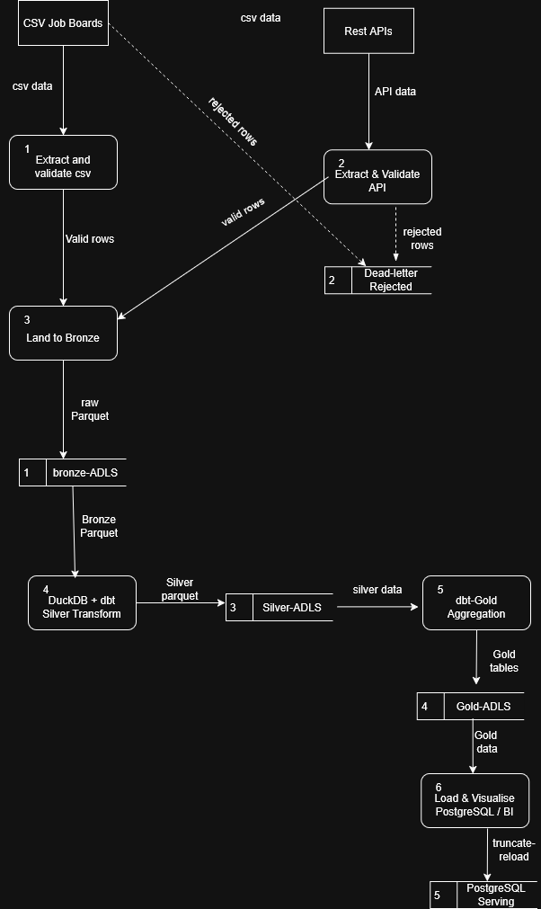
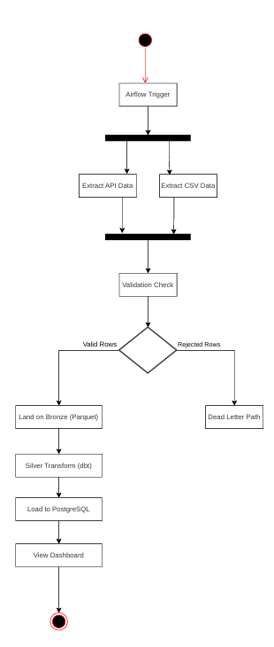
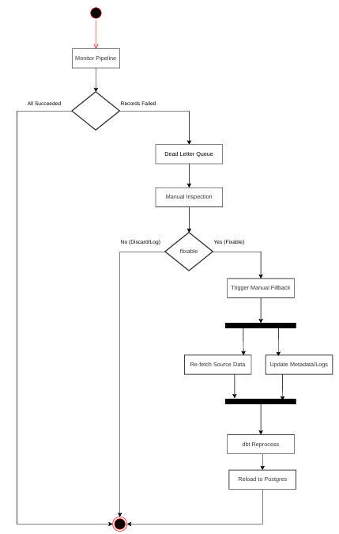
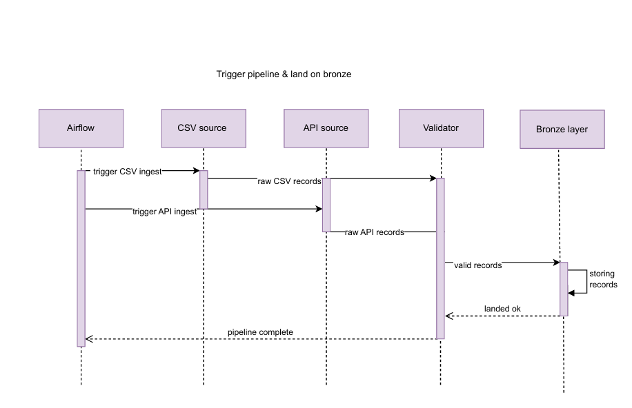
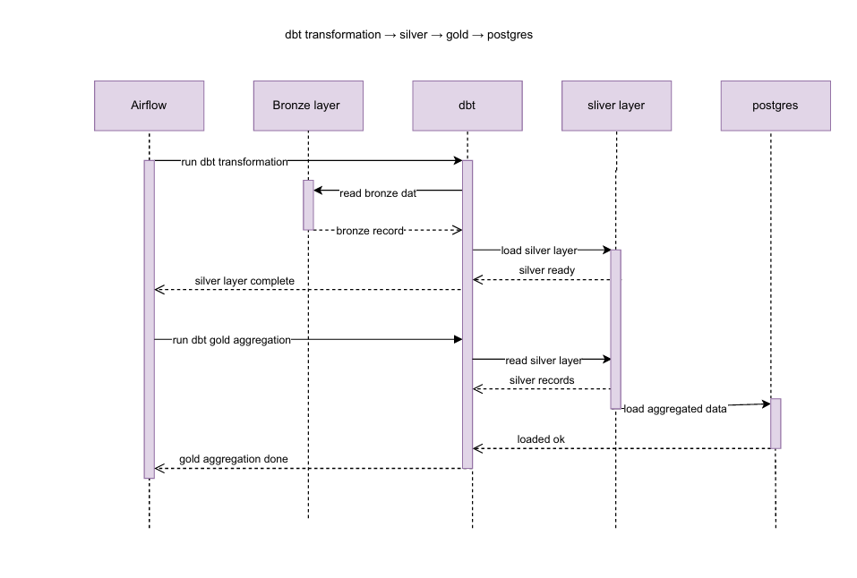
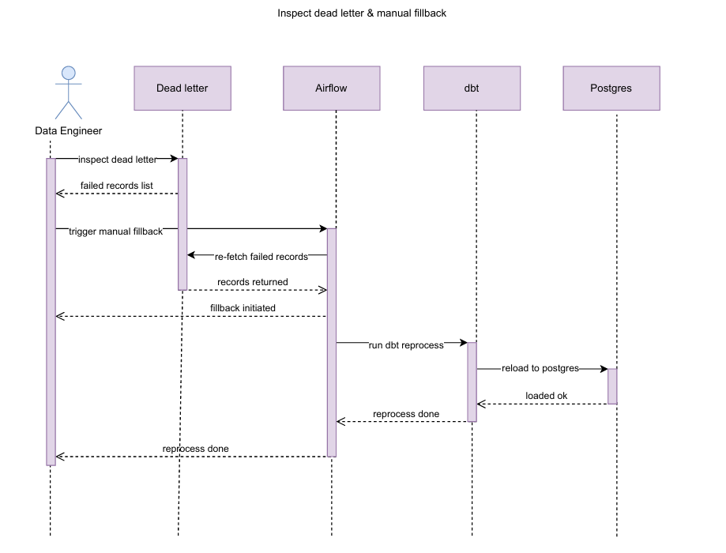

# Software Requirements Specification
## Job Trends Data Engineering Pipeline

**Version:** 1.0 | **Date:** April 2026 | **Status:** Confidential

> **Tech Stack:** ELT Architecture · Azure ADLS Gen2 · DuckDB · dbt · Apache Airflow · PostgreSQL

---

## Document Scope

This SRS defines the functional and non-functional requirements for the **Job Trends Data Engineering Pipeline** — an ELT system that ingests job listing data from CSV job boards and REST APIs, transforms it through Bronze, Silver, and Gold Azure Data Lake Storage layers using DuckDB and dbt, and serves aggregated job market trends via PostgreSQL and a BI dashboard.

Requirements follow the `"The system shall..."` format and adhere to SMART criteria. Each requirement is assigned a MoSCoW priority.

**Priority Legend:**

| Symbol | Priority | MoSCoW |
|--------|----------|--------|
| 🔴 | High | Must Have |
| 🟡 | Medium | Should Have |
| 🟢 | Low | Could Have |

---

## Table of Contents

1. [Functional Requirements](#1-functional-requirements)
   - 1.1 [Data Ingestion](#11-data-ingestion)
   - 1.2 [Data Transformation](#12-data-transformation)
   - 1.3 [Data Serving & Dashboard](#13-data-serving--dashboard)
   - 1.4 [Orchestration & Operations](#14-orchestration--operations)
2. [Non-Functional Requirements](#2-non-functional-requirements)
   - 2.1 [Performance & Efficiency](#21-performance--efficiency)
   - 2.2 [Reliability & Fault Tolerance](#22-reliability--fault-tolerance)
   - 2.3 [Security & Access Control](#23-security--access-control)
   - 2.4 [Maintainability & Observability](#24-maintainability--observability)
   - 2.5 [Scalability & Portability](#25-scalability--portability)
3. [Use Case Descriptions](#3-use-case-descriptions-and-scenarios)
4. [Use Case Diagram](#4-use-case-diagram)
5. [Data Flow Diagram](#5-data-flow-diagram-dfd)
6. [Activity Diagrams](#6-activity-diagrams)
7. [Sequence Diagrams](#7-sequence-diagrams)
8. [Entity Relationship Diagram](#8-entity-relationship-diagram-erd)

---

## 1. Functional Requirements

The requirements below define all observable, testable behaviours the pipeline system must exhibit.

### 1.1 Data Ingestion

| ID | Requirement (The system shall…) | Rationale | Priority |
|----|--------------------------------|-----------|----------|
| FR-01 | Ingest raw job listing data from CSV files exported by external job board sources on a daily scheduled basis. | CSV files are the primary offline data channel; daily ingestion maintains data freshness. | 🔴 High |
| FR-02 | Ingest real-time job listing data by calling external REST API endpoints, applying exponential-backoff retry logic upon transient HTTP failures. | Retry logic ensures completeness without manual intervention. | 🔴 High |
| FR-03 | Parse and validate each ingested record against a defined Pydantic schema before any downstream processing, enforcing mandatory field presence and data-type constraints. | Early validation prevents corrupted data from propagating through the pipeline. | 🔴 High |
| FR-04 | Route all records that fail schema validation to a dedicated dead-letter store, preserving the original record content and the reason for rejection. | Dead-letter storage enables auditability and manual reprocessing of rejected records without data loss. | 🔴 High |
| FR-05 | Land all validated records from both CSV and API sources as raw Parquet files in the Bronze layer of Azure Data Lake Storage Gen2. | Parquet columnar format enables efficient downstream reads; Bronze layer preserves the raw state for reprocessing. | 🔴 High |
| FR-06 | Process CSV files in configurable chunk sizes to limit peak memory consumption during ingestion. | Chunked reading prevents out-of-memory failures on large CSV files. | 🟡 Medium |

### 1.2 Data Transformation

| ID | Requirement (The system shall…) | Rationale | Priority |
|----|--------------------------------|-----------|----------|
| FR-07 | Execute dbt Silver transformation models using DuckDB as the SQL execution engine, reading Bronze Parquet files directly from ADLS and producing deduplicated, cleaned, source-staged Silver Parquet files. | DuckDB provides serverless, high-performance SQL execution without a persistent cluster; dbt enforces modular, testable transformations. | 🔴 High |
| FR-08 | Deduplicate job records within the Silver transform layer, retaining the most recently ingested record when duplicate job identifiers are detected across sources. | Duplicate records from overlapping CSV and API sources would distort trend analytics. | 🔴 High |
| FR-09 | Execute dbt Gold aggregation models to UNION all Silver sources and produce exactly five aggregated Gold tables covering job titles, locations, salary bands, skills demand, and posting trends. | Gold tables provide the pre-aggregated datasets required by the BI dashboard, minimising query-time computation. | 🔴 High |
| FR-10 | Write all Silver and Gold transformed outputs as Parquet files to their respective ADLS layers before any downstream step proceeds. | Materialising intermediate layers provides checkpoint recovery points and supports independent re-runs. | 🟡 Medium |

### 1.3 Data Serving & Dashboard

| ID | Requirement (The system shall…) | Rationale | Priority |
|----|--------------------------------|-----------|----------|
| FR-11 | Load all five Gold tables into a PostgreSQL serving database using a truncate-and-reload strategy on every pipeline run. | Truncate-reload guarantees that the serving layer always reflects the latest full Gold snapshot without partial-update anomalies. | 🔴 High |
| FR-12 | Expose job trend data through a BI dashboard that allows end-users to filter job listings by title, location, date range, and salary band. | Interactive filtering is the primary analytical use case for the Data Analyst actor. | 🔴 High |
| FR-13 | Display aggregated trend visualisations on the dashboard, including time-series charts of job posting volumes, geographic heat maps, and top-skills frequency rankings. | Visual aggregations communicate trends that are not apparent from raw tabular data. | 🔴 High |

### 1.4 Orchestration & Operations

| ID | Requirement (The system shall…) | Rationale | Priority |
|----|--------------------------------|-----------|----------|
| FR-14 | Orchestrate the full pipeline as a directed acyclic graph (DAG) managed by Apache Airflow, triggered automatically once per day. | A DAG enforces step ordering, dependency resolution, and provides a full audit log of each run. | 🔴 High |
| FR-15 | Allow a Data Engineer to manually trigger a backfill run for any specified historical date range from the Airflow UI without modifying pipeline code. | Backfill capability is necessary for recovering from upstream data outages or schema changes. | 🟡 Medium |
| FR-16 | Expose pipeline run status, task-level logs, and dead-letter record counts to the Data Engineer through the Airflow monitoring interface. | Operational visibility enables rapid diagnosis and resolution of pipeline failures. | 🟡 Medium |

---

## 2. Non-Functional Requirements

Non-functional requirements define the quality attributes the system must satisfy. They are categorised using the **ISO 25010** quality model and include measurable acceptance thresholds.

### 2.1 Performance & Efficiency

| ID | Requirement (The system shall…) | Rationale | Priority |
|----|--------------------------------|-----------|----------|
| NFR-01 | Complete the full daily pipeline run from ingestion trigger to PostgreSQL load completion within a **four-hour** processing window. | A four-hour window ensures dashboard data is refreshed and available to analysts by the start of the working day. | 🔴 High |
| NFR-02 | Sustain ingestion throughput of at least **500,000 job records per run** without exceeding available memory, by processing CSV files in configurable chunks and streaming API responses. | Chunked processing decouples memory consumption from input file size, enabling scalable ingestion. | 🔴 High |
| NFR-03 | Execute DuckDB SQL transformations directly against ADLS-resident Parquet files without staging data to a local disk, keeping transformation latency below **30 minutes** for up to 5 million records. | In-place Parquet execution eliminates redundant data movement and reduces end-to-end latency. | 🟡 Medium |

### 2.2 Reliability & Fault Tolerance

| ID | Requirement (The system shall…) | Rationale | Priority |
|----|--------------------------------|-----------|----------|
| NFR-04 | Guarantee that no validated record is silently discarded; every record that fails validation must appear in the dead-letter store with its rejection reason before the pipeline proceeds. | Silent data loss is undetectable and would produce incorrect trend analytics. | 🔴 High |
| NFR-05 | Produce an idempotent pipeline such that re-executing any run for the same logical date produces identical output in the Gold and PostgreSQL layers. | Idempotency enables safe retries and backfills without manual cleanup steps. | 🔴 High |
| NFR-06 | Achieve a pipeline success rate of at least **99%** over any rolling 30-day period, excluding failures caused by prolonged upstream API outages exceeding four hours. | High reliability is required to maintain daily dashboard freshness for business stakeholders. | 🔴 High |

### 2.3 Security & Access Control

| ID | Requirement (The system shall…) | Rationale | Priority |
|----|--------------------------------|-----------|----------|
| NFR-07 | Authenticate all access to Azure Data Lake Storage Gen2 using managed identities or service-principal credentials stored in a secrets manager; no credentials shall be embedded in pipeline code or configuration files. | Credential exposure in code repositories is a leading cause of data breaches. | 🔴 High |
| NFR-08 | Enforce role-based access control such that Data Analysts can read Gold tables and the dashboard, but cannot access Bronze or Silver layers or modify pipeline configuration. | Least-privilege access reduces the blast radius of accidental or malicious data modification. | 🔴 High |

### 2.4 Maintainability & Observability

| ID | Requirement (The system shall…) | Rationale | Priority |
|----|--------------------------------|-----------|----------|
| NFR-09 | Version-control all dbt models, Airflow DAG definitions, and Pydantic schemas in a source-code repository, with changes deployable via a CI/CD pipeline without manual file copies. | Version control and CI/CD are prerequisites for repeatable, auditable change management. | 🟡 Medium |
| NFR-10 | Emit structured logs for every pipeline task including record counts, rejected-row counts, transformation durations, and load row counts in a format queryable by the Airflow monitoring interface. | Structured logs enable automated alerting and post-mortem analysis without parsing free-text output. | 🟡 Medium |
| NFR-11 | Be architected such that adding a new data source requires changes only to the ingestion and Silver dbt layers, with no modifications required to Gold models or the serving layer. | Source isolation limits the scope of change when onboarding new job boards. | 🟢 Low |

### 2.5 Scalability & Portability

| ID | Requirement (The system shall…) | Rationale | Priority |
|----|--------------------------------|-----------|----------|
| NFR-12 | Be deployable on infrastructure that can scale DuckDB compute and ADLS storage independently, without requiring changes to pipeline code when data volumes increase by up to **ten times** the baseline. | Compute and storage decoupling is fundamental to cloud-native scalability. | 🟡 Medium |

---

## 3. Use Case Descriptions and Scenarios

### UC-01 — Ingest CSV Data

| Field | Detail |
|-------|--------|
| **Use Case ID** | UC-01 |
| **Actor(s)** | CSV Job Boards (External System), Airflow Scheduler (System Actor) |
| **Trigger** | The Airflow daily schedule fires at the configured time, or a Data Engineer manually triggers the DAG. |
| **Preconditions** | CSV files are available in the designated landing zone. The Pydantic schema definition is deployed and current. |
| **Normal Flow** | 1. Airflow triggers the `extract_csv` task. 2. The system reads the CSV file in configurable chunks using pandas. 3. Each chunk is validated against the Pydantic schema. 4. Valid rows are batched and written as raw Parquet to the Bronze ADLS layer. 5. The task completes and reports record counts to the Airflow log. |
| **Alternative Flow** | **A-1 (Partial rejection):** Some rows fail validation. The system routes failed rows to the dead-letter store with their rejection reason and continues processing the remaining valid rows. The task succeeds with a warning. |
| **Exception Flow** | **E-1 (File not found):** The CSV file is absent or inaccessible. The task fails, Airflow marks it as failed, and a notification is sent to the Data Engineer. |
| **Postconditions** | Valid job records are persisted as Parquet in Bronze ADLS. Rejected records are stored in the dead-letter table with rejection reasons. |
| **Related Reqs** | FR-01, FR-03, FR-04, FR-05, FR-06 |

---

### UC-02 — Ingest API Data

| Field | Detail |
|-------|--------|
| **Use Case ID** | UC-02 |
| **Actor(s)** | REST APIs (External System), Airflow Scheduler (System Actor) |
| **Trigger** | Airflow triggers the `extract_api` task as part of the daily DAG run. |
| **Preconditions** | REST API credentials are available in the secrets manager. The network is accessible to the external API endpoints. |
| **Normal Flow** | 1. Airflow triggers the `extract_api` task. 2. The system sends authenticated HTTP requests to each configured API endpoint. 3. API responses are streamed and parsed record by record. 4. Each record is validated against the Pydantic schema. 5. Valid records are written as raw Parquet to the Bronze ADLS layer. |
| **Alternative Flow** | **A-1 (Transient HTTP failure):** A request fails with a 5xx or timeout. The system applies exponential-backoff retry logic for up to three attempts before routing it to the dead-letter store. |
| **Exception Flow** | **E-1 (API authentication failure):** Credentials are invalid or expired. The task fails immediately, logs the error, and Airflow notifies the Data Engineer. |
| **Postconditions** | All successfully retrieved API records are persisted as Parquet in Bronze ADLS. Unrecoverable records are stored in the dead-letter table. |
| **Related Reqs** | FR-02, FR-03, FR-04, FR-05 |

---

### UC-03 — Run Silver Transformation

| Field | Detail |
|-------|--------|
| **Use Case ID** | UC-03 |
| **Actor(s)** | Airflow Scheduler (System Actor) |
| **Trigger** | The Bronze landing tasks (UC-01, UC-02) complete successfully for the current DAG run. |
| **Preconditions** | Bronze Parquet files for the current run date are available in ADLS. DuckDB is configured to access the ADLS Bronze container. dbt Silver models are deployed. |
| **Normal Flow** | 1. Airflow triggers the `dbt_run_silver` task. 2. DuckDB reads Bronze Parquet files directly from ADLS without local staging. 3. dbt Silver models execute: cleaning null values, standardising field formats, and deduplicating records by job identifier. 4. Cleaned Silver Parquet files are written to the Silver ADLS layer. 5. dbt logs row counts and test results. |
| **Alternative Flow** | **A-1 (dbt test failure):** A dbt data quality test fails. The task is marked as failed. Downstream Gold and PostgreSQL tasks do not execute. |
| **Postconditions** | Silver Parquet files containing clean, deduplicated, source-staged records are available in the Silver ADLS layer. |
| **Related Reqs** | FR-07, FR-08, FR-10, NFR-03 |

---

### UC-04 — Run Gold Aggregation

| Field | Detail |
|-------|--------|
| **Use Case ID** | UC-04 |
| **Actor(s)** | Airflow Scheduler (System Actor) |
| **Trigger** | The Silver transformation task (UC-03) completes successfully. |
| **Preconditions** | Silver Parquet files for the current run date are available in the Silver ADLS layer. dbt Gold models are deployed. |
| **Normal Flow** | 1. Airflow triggers the `dbt_run_gold` task. 2. DuckDB reads Silver Parquet files. 3. dbt Gold models UNION records from all Silver sources and compute five aggregated tables: job title trends, location distributions, salary band summaries, skills demand rankings, and daily posting volumes. 4. Gold Parquet files are written to the Gold ADLS layer. |
| **Postconditions** | Five aggregated Gold tables are materialised in the Gold ADLS layer, ready for loading into PostgreSQL. |
| **Related Reqs** | FR-09, FR-10 |

---

### UC-05 — Load PostgreSQL Serving Layer

| Field | Detail |
|-------|--------|
| **Use Case ID** | UC-05 |
| **Actor(s)** | Airflow Scheduler (System Actor) |
| **Trigger** | The Gold aggregation task (UC-04) completes successfully. |
| **Preconditions** | Gold ADLS files are current. PostgreSQL connection credentials are available in the secrets manager. |
| **Normal Flow** | 1. Airflow triggers the `load_postgres` task. 2. For each of the five Gold tables, the system truncates the existing PostgreSQL table. 3. The system loads the corresponding Gold Parquet data into the now-empty table. 4. Row counts are verified and reported to Airflow logs. |
| **Alternative Flow** | **A-1 (Row count mismatch):** Loaded row count does not match the Gold source. The system logs an error and marks the task as failed without committing the partial load. |
| **Postconditions** | All five Gold tables in PostgreSQL reflect the latest aggregated data. The BI dashboard is immediately up to date. |
| **Related Reqs** | FR-11, NFR-05 |

---

### UC-06 — View Job Trend Dashboard

| Field | Detail |
|-------|--------|
| **Use Case ID** | UC-06 |
| **Actor(s)** | Data Analyst |
| **Trigger** | The Data Analyst opens the BI dashboard in a web browser. |
| **Preconditions** | PostgreSQL Gold tables have been loaded successfully by the most recent pipeline run. The analyst has Read access to the dashboard. |
| **Normal Flow** | 1. The analyst opens the dashboard. 2. The dashboard queries PostgreSQL and renders default trend visualisations. 3. The analyst applies filters: job title, location, date range, salary band. 4. The dashboard re-queries and updates all charts in real time. 5. The analyst views time-series charts, geographic heat maps, and skills frequency rankings. |
| **Alternative Flow** | **A-1 (No data for filter):** The selected filter combination returns no records. The dashboard displays an empty-state message prompting the analyst to widen the filter criteria. |
| **Postconditions** | The analyst has reviewed job market trends and can export or share the filtered view. |
| **Related Reqs** | FR-12, FR-13 |

---

### UC-07 — Monitor Pipeline Runs

| Field | Detail |
|-------|--------|
| **Use Case ID** | UC-07 |
| **Actor(s)** | Data Engineer |
| **Trigger** | The Data Engineer opens the Airflow UI to check the status of a completed or in-progress pipeline run. |
| **Preconditions** | The Airflow web server is running and the engineer has operator-level access. |
| **Normal Flow** | 1. The engineer navigates to the Airflow DAG view. 2. The system displays the run history with status (success, running, failed) for each run. 3. The engineer clicks a specific run to view task-level status. 4. The engineer opens a task log to inspect record counts, rejected-row counts, and transformation durations. |
| **Alternative Flow** | **A-1 (Failed task):** The engineer identifies a failed task, reads the error message in the task log, and decides to trigger a manual backfill (UC-08) or inspect the dead-letter store (UC-09). |
| **Postconditions** | The engineer has full visibility into the run outcome and can take corrective action if required. |
| **Related Reqs** | FR-16, NFR-10 |

---

### UC-08 — Trigger Manual Backfill

| Field | Detail |
|-------|--------|
| **Use Case ID** | UC-08 |
| **Actor(s)** | Data Engineer |
| **Trigger** | The Data Engineer identifies that one or more historical pipeline runs failed or produced incorrect output. |
| **Preconditions** | The engineer has operator-level Airflow access. Source data for the target date range is available or has been corrected. |
| **Normal Flow** | 1. The engineer navigates to the Airflow DAG page and selects the Backfill option. 2. The engineer specifies the start and end dates for the backfill. 3. Airflow schedules and executes the full pipeline for each missing date in order. 4. The pipeline produces identical Gold and PostgreSQL output as a regular run. 5. The engineer confirms successful completion via the monitoring view. |
| **Postconditions** | Historical Gold and PostgreSQL data for the specified date range is corrected and consistent with current data. |
| **Related Reqs** | FR-15, NFR-05 |

---

### UC-09 — Inspect Dead-Letter Records

| Field | Detail |
|-------|--------|
| **Use Case ID** | UC-09 |
| **Actor(s)** | Data Engineer |
| **Trigger** | The pipeline run completes with a non-zero rejected-row count, or the engineer proactively reviews the dead-letter store. |
| **Preconditions** | The dead-letter table is populated with one or more rejected records. The engineer has read access to the dead-letter store. |
| **Normal Flow** | 1. The engineer queries the dead-letter store to list failed records. 2. The system returns each record with its `raw_data` and `error_message`. 3. The engineer identifies the root cause. 4. If fixable, the engineer corrects the source data and triggers a manual backfill (UC-08). 5. If non-recoverable, the engineer marks them as resolved and updates the `is_resolved` flag. |
| **Alternative Flow** | **A-1 (Fixable batch):** The engineer determines the rejection was caused by a temporary upstream schema change. After correction, a backfill re-processes the affected date range. |
| **Postconditions** | All dead-letter records have a documented resolution. The `is_resolved` flag is updated. Recovered records are re-ingested where applicable. |
| **Related Reqs** | FR-04, FR-16, NFR-04 |

---

## 4. Use Case Diagram

The use case diagram illustrates the boundary of the Job Trends Pipeline system and all interactions between external actors and the system's use cases.


### Actors

| Actor | Type | Description |
|-------|------|-------------|
| CSV Job Boards | External System | Supplies raw CSV job listings |
| REST APIs | External System | Provides live job data via HTTP endpoints |
| Airflow Scheduler | System Actor | Triggers all automated pipeline tasks daily |
| Data Analyst | Human | Queries and interacts with the BI dashboard |
| Data Engineer | Human | Monitors, backfills, and inspects failures |

### Use Cases Summary

| Use Case | Relationships |
|----------|---------------|
| UC-01 Ingest CSV Data | `<<include>>` Validate & Reject Records, Land to Bronze |
| UC-02 Ingest API Data | `<<include>>` Validate & Reject Records, Land to Bronze |
| UC-03 Run Silver Transformation | — |
| UC-04 Run Gold Aggregation | — |
| UC-05 Load PostgreSQL Serving Layer | — |
| UC-06 View Job Trend Dashboard | — |
| UC-07 Monitor Pipeline Runs | — |
| UC-08 Trigger Manual Backfill | — |
| UC-09 Inspect Dead-Letter Records | `<<extend>>` Validate & Reject Records |

---

## 5. Data Flow Diagram (DFD)

The DFD shows how data moves through the pipeline from its two external sources to the serving layer.



### Key Flows

| From | Process | To |
|------|---------|-----|
| CSV Job Boards | Process 1 — Extract & Validate CSV | Bronze ADLS |
| REST APIs | Process 2 — Extract & Validate API | Bronze ADLS |
| Both sources (rejected rows) | — | Dead-Letter Store |
| Bronze ADLS | Process 4 — DuckDB + dbt Silver Transform | Silver ADLS |
| Silver ADLS | Process 5 — dbt Gold Aggregation | Gold ADLS |
| Gold ADLS | Process 6 — Load & Visualise | PostgreSQL Serving / BI Dashboard |

---

## 6. Activity Diagrams

### 6.1 Main Pipeline Execution Flow

This activity diagram shows the complete end-to-end pipeline triggered by Airflow. It captures parallel ingestion from CSV and API sources, the validation decision gate, the sequential Bronze → Silver → Gold transformation chain, and the final load to PostgreSQL.



**Flow Summary:**
```
Airflow Trigger
    ├── Extract API Data  ──┐
    └── Extract CSV Data ──┘
              ↓
       Validation Check
       ↙            ↘
 Valid Rows      Rejected Rows
     ↓                ↓
Land on Bronze    Dead Letter Path
     ↓
Silver Transform (dbt)
     ↓
Load to PostgreSQL
     ↓
View Dashboard
```

### 6.2 Dead-Letter Monitoring and Manual Reprocessing Flow

This activity diagram shows what happens after a pipeline run produces rejected records.



**Flow Summary:**
```
Monitor Pipeline
    ├── All Succeeded → END
    └── Records Failed
              ↓
       Dead Letter Queue
              ↓
       Manual Inspection
       ↙            ↘
No (Discard/Log)  Yes (Fixable)
                      ↓
              Trigger Manual Backfill
              ├── Re-fetch Source Data
              └── Update Metadata/Logs
                      ↓
               dbt Reprocess
                      ↓
              Reload to Postgres
```

---

## 7. Sequence Diagrams

### 7.1 Pipeline Trigger and Bronze Landing Sequence

This sequence diagram covers the first phase of the pipeline: Airflow triggers parallel ingestion from CSV and API sources, both send raw records to the Validator, and valid records are landed on the Bronze ADLS layer.



```
Airflow → CSV source   : trigger CSV ingest
Airflow → API source   : trigger API ingest
CSV source → Validator : raw CSV records
API source → Validator : raw API records
Validator → Bronze     : valid records
Bronze → Bronze        : storing records
Bronze → Airflow       : landed ok
Airflow ← all          : pipeline complete
```

### 7.2 dbt Transformation → Silver → Gold → PostgreSQL

This sequence diagram covers the transformation phase: dbt reads from Bronze, produces Silver, aggregates to Gold, and loads PostgreSQL.



```
Airflow → dbt          : run dbt transformation
dbt → Bronze layer     : read bronze data
dbt → Silver layer     : load silver layer
Silver layer → dbt     : silver ready
Airflow ← dbt          : silver layer complete

Airflow → dbt          : run dbt gold aggregation
dbt → Silver layer     : read silver layer
Silver layer → dbt     : silver records
dbt → Postgres         : load aggregated data
Postgres → dbt         : loaded ok
Airflow ← dbt          : gold aggregation done
```

### 7.3 Inspect Dead-Letter and Manual Backfill Sequence

This sequence diagram shows the interaction flow when a Data Engineer responds to failed records.



```
Engineer → Dead letter : inspect dead letter
Dead letter → Engineer : failed records list
Engineer → Airflow     : trigger manual backfill
Airflow → Dead letter  : re-fetch failed records
Dead letter → Airflow  : records returned
Airflow → Engineer     : backfill initiated
Airflow → dbt          : run dbt reprocess
dbt → Postgres         : reload to postgres
Postgres → dbt         : loaded ok
dbt → Airflow          : reprocess done
Airflow → Engineer     : reprocess done
```

---

## 8. Entity Relationship Diagram (ERD)

The ERD defines the logical data model for the Gold serving layer and the supporting operational tables. The model follows a **star-schema** pattern centred on the `FACT_JOB_POSTING` table.


### Entity Summary

| Entity | Type | Description |
|--------|------|-------------|
| `FACT_JOB_POSTING` | Fact Table | Central fact table. One row per unique job listing. Foreign keys link to DIM_COMPANY, DIM_LOCATION, DIM_SEARCH_CITY, and DATA_SOURCE. Boolean flags track NLP enrichment status (`got_summary`, `got_ner`). |
| `FACT_JOB_TREND_DAILY` | Fact Table | Daily aggregated trend fact. Stores `job_count`, `new_jobs`, and `expired_jobs` per company, location, and source combination. |
| `DIM_COMPANY` | Dimension | `company_id`, `company_name` |
| `DIM_LOCATION` | Dimension | `job_location`, `city`, `state`, `country` |
| `DIM_SEARCH_CITY` | Dimension | Records the city used as the search parameter when the job was fetched. |
| `DATA_SOURCE` | Dimension | Tracks whether a record originated from a CSV file or an API endpoint (`source_type`, `source_name`). |
| `DEAD_LETTER` | Operational | Stores rejected records with `raw_data`, `error_message`, and `is_resolved` flag. |
| `PIPELINE_RUN` | Audit | Logs each Airflow DAG run with `status`, `records_extracted`, and `records_rejected` counts. |
| `NER_ENTITY` | Enrichment | Stores named entities extracted from job descriptions via NLP enrichment, linked to `FACT_JOB_POSTING` by `job_id`. |

---

*Job Trends Pipeline — Software Requirements Specification | v1.0 | Confidential*
